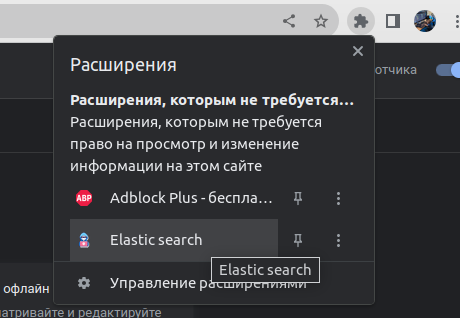

# Инструкция по проекту

### 1.Добавление вопросов и ответов в файл `data.json`:

- Откройте файл `data.json` и добавьте свои вопросы и ответы в следующем формате:

   ```json
   [
     {
       "question": "Ваш вопрос",
       "answer": "Ваш ответ"
     },
     {
       "question": "Ваш вопрос",
       "answer": "Ваш ответ"
     },
     {
       "question": "Ваш вопрос",
       "answer": "Ваш ответ"
     }
   ]

Сохраните файл после добавления вопросов и ответов.

### 🚀 Загрузка расширения в браузер Chrome

1. Нажмите три точки в верхнем правом углу браузера.
2. Перейдите в раздел "Расширения".
3. Включите "Режим разработчика", переключив свитч в правом верхнем углу.
4. Нажмите "Загрузить распакованное расширение" и выберите <b>папку!</b> с вашим проектом.

Расширение теперь должно быть успешно загружено в браузер Chrome. </br>
Открыть расширение нажав на значок головоломки и выбрав наше расширение



### 🦊 Загрузка расширения в браузер Firefox
1. В адресную строку браузера вставьте [about:debugging#/runtime/this-firefox](about:debugging#/runtime/this-firefox)
2. Загрузить временное дополнение
3. Выбираете <b>! manifest.json !</b> в папке нашего проекта

### 3. Использование
Ищите вопросы по ключевым словам, поиск работает только по вопросам, а не по ответам

### Пользуйтесь, юные хакеры! 😈